# Database Schema Design — SkyRoster

**Module:** SkyRoster Core (All Modules)
**Last Updated:** 2026-03-09 (Rev. 2 — added `crew_unavailabilities`, `system_notifications`)

---

## 1. Entity Relationship Diagram

```mermaid
erDiagram
    users ||--o{ crew_members : "is a"
    crew_members ||--o{ crew_documents : "has"
    crew_members ||--o{ crew_type_ratings : "holds"
    crew_members ||--o{ roster_assignments : "assigned to"
    crew_members ||--o{ sign_on_records : "signs on"
    crew_members ||--o{ voyage_reports : "submits"

    aircraft_types ||--o{ crew_complements : "requires"
    aircraft_types ||--o{ crew_type_ratings : "qualifies for"
    aircraft_types ||--o{ flights : "operated by"

    pairings ||--|{ flights : "contains"
    pairings ||--o{ roster_assignments : "assigned via"

    flights ||--o{ sign_on_records : "has"
    flights ||--o{ voyage_reports : "has"
    flights ||--o{ disruption_events : "may have"

    roster_publications ||--o{ roster_assignments : "publishes"

    crew_members ||--o{ flight_hour_logs : "tracked in"
    crew_members ||--o{ standby_assignments : "on standby"
    crew_members ||--o{ crew_unavailabilities : "unavailable for"
    crew_members ||--o{ system_notifications : "receives"

    airports |o--o{ flights : "origin/destination"

    users {
        uuid id PK
        string email UK
        string hashed_password
        string role "ADMIN, ROSTER_OFFICER, CREW"
        boolean is_active
        timestamp created_at
        timestamp updated_at
    }

    crew_members {
        uuid id PK
        uuid user_id FK
        string staff_id UK
        string first_name
        string last_name
        string crew_role "CAPTAIN, FIRST_OFFICER, PURSER, FLIGHT_ATTENDANT"
        string crew_category "FLIGHT_CREW, CABIN_CREW"
        string base_station "IATA code"
        string status "ACTIVE, GROUNDED, ON_LEAVE"
        string grounding_reason
        timestamp grounded_at
        timestamp created_at
        timestamp updated_at
    }

    crew_documents {
        uuid id PK
        uuid crew_member_id FK
        string document_type "MEDEX, ATPL, CPL, INSTRUMENT_RATING, SEP, SIM_CHECK, TYPE_RATING_CERT"
        string document_number
        date issue_date
        date expiry_date
        string status "VALID, EXPIRING_SOON, EXPIRED"
        string file_url
        timestamp created_at
        timestamp updated_at
    }

    crew_type_ratings {
        uuid id PK
        uuid crew_member_id FK
        uuid aircraft_type_id FK
        date qualified_date
        date expiry_date
        boolean is_active
    }

    aircraft_types {
        uuid id PK
        string icao_code UK "B738, A320"
        string name "Boeing 737-800, Airbus A320"
        boolean is_active
    }

    crew_complements {
        uuid id PK
        uuid aircraft_type_id FK
        string crew_role "CAPTAIN, FIRST_OFFICER, PURSER, FLIGHT_ATTENDANT"
        int min_required
        int max_allowed
    }

    airports {
        uuid id PK
        string iata_code UK "CGK, SUB, DPS"
        string name
        string city
        string country
        decimal latitude
        decimal longitude
    }

    pairings {
        uuid id PK
        string pairing_code UK
        date start_date
        date end_date
        uuid aircraft_type_id FK
        string status "DRAFT, ASSIGNED, PUBLISHED"
        uuid created_by FK
        timestamp created_at
        timestamp updated_at
    }

    flights {
        uuid id PK
        uuid pairing_id FK
        string flight_number
        uuid origin_airport_id FK
        uuid destination_airport_id FK
        uuid aircraft_type_id FK
        timestamp scheduled_departure "STD"
        timestamp scheduled_arrival "STA"
        timestamp actual_block_off "ABO"
        timestamp actual_block_on "ABON"
        int leg_sequence "Order within pairing"
        string status "SCHEDULED, BOARDING, DEPARTED, ARRIVED, CANCELLED"
        timestamp created_at
        timestamp updated_at
    }

    roster_assignments {
        uuid id PK
        uuid crew_member_id FK
        uuid pairing_id FK
        uuid publication_id FK
        string assigned_role "CAPTAIN, FIRST_OFFICER, PURSER, FLIGHT_ATTENDANT"
        string status "ASSIGNED, CONFIRMED, NO_SHOW, SICK, REPLACED"
        timestamp assigned_at
        uuid assigned_by FK
    }

    roster_publications {
        uuid id PK
        date effective_from
        date effective_to
        string status "DRAFT, PUBLISHED, SUPERSEDED"
        uuid published_by FK
        timestamp published_at
    }

    sign_on_records {
        uuid id PK
        uuid crew_member_id FK
        uuid flight_id FK
        timestamp sign_on_time
        decimal latitude
        decimal longitude
        boolean is_within_geofence
        string sign_on_method "APP_GPS, MANUAL_OVERRIDE"
        timestamp created_at
    }

    voyage_reports {
        uuid id PK
        uuid flight_id FK
        uuid submitted_by FK "crew_member_id of Captain/Purser"
        timestamp actual_block_off
        timestamp actual_block_on
        decimal calculated_flight_hours
        string delay_code
        text remarks
        string status "SUBMITTED, APPROVED, REJECTED"
        timestamp submitted_at
        uuid approved_by FK
        timestamp approved_at
    }

    flight_hour_logs {
        uuid id PK
        uuid crew_member_id FK
        uuid flight_id FK
        uuid voyage_report_id FK
        date flight_date
        decimal flight_hours
        decimal duty_hours
        timestamp block_off
        timestamp block_on
        timestamp created_at
    }

    disruption_events {
        uuid id PK
        uuid flight_id FK
        uuid affected_crew_id FK
        string disruption_type "NO_SHOW, SICK, DELAYED, CANCELLED"
        string resolution_status "OPEN, STANDBY_DEPLOYED, RESOLVED"
        uuid replacement_crew_id FK
        uuid resolved_by FK
        text notes
        timestamp reported_at
        timestamp resolved_at
    }

    standby_assignments {
        uuid id PK
        uuid crew_member_id FK
        date standby_date
        string standby_window_start "HH:mm"
        string standby_window_end "HH:mm"
        string status "AVAILABLE, DEPLOYED, RELEASED"
        uuid deployed_to_flight_id FK
    }

    crew_unavailabilities {
        uuid id PK
        uuid crew_member_id FK
        string unavailability_type "ANNUAL_LEAVE, GROUND_TRAINING, MEDICAL_LEAVE, PERSONAL_LEAVE, SIM_TRAINING"
        date start_date
        date end_date
        string status "REQUESTED, APPROVED, REJECTED, CANCELLED"
        text remarks
        uuid approved_by FK
        timestamp created_at
        timestamp updated_at
    }

    system_notifications {
        uuid id PK
        uuid recipient_user_id FK
        uuid related_crew_id FK
        string notification_type "DOC_EXPIRY_30D, DOC_EXPIRY_14D, DOC_EXPIRY_7D, DOC_EXPIRED, FTL_WARNING, DISRUPTION_ALERT, ROSTER_PUBLISHED, ROSTER_CHANGE"
        string severity "INFO, WARNING, CRITICAL"
        string title
        text message
        string entity_type
        uuid entity_id
        string channel "IN_APP, EMAIL, PUSH"
        boolean is_read
        boolean is_sent
        timestamp sent_at
        timestamp read_at
        timestamp created_at
    }

    audit_logs {
        uuid id PK
        uuid user_id FK
        string entity_type "CREW_MEMBER, ROSTER, FLIGHT, DOCUMENT"
        uuid entity_id
        string action "CREATE, UPDATE, DELETE, GROUND, PUBLISH"
        jsonb old_values
        jsonb new_values
        string ip_address
        timestamp created_at
    }
```

---

## 2. Table Definitions

### Table: `users`
| Column | Type | Nullable | Default | Description |
| :--- | :--- | :--- | :--- | :--- |
| `id` | UUID | No | gen_random_uuid() | Primary Key |
| `email` | VARCHAR(255) | No | — | Unique login email |
| `hashed_password` | VARCHAR(255) | No | — | BCrypt hashed password (🔒) |
| `role` | VARCHAR(50) | No | — | System role (ADMIN, ROSTER_OFFICER, CREW) |
| `is_active` | BOOLEAN | No | true | Soft-delete flag |
| `created_at` | TIMESTAMPTZ | No | NOW() | Record creation timestamp |
| `updated_at` | TIMESTAMPTZ | No | NOW() | Last update timestamp |

### Table: `crew_members`
| Column | Type | Nullable | Default | Description |
| :--- | :--- | :--- | :--- | :--- |
| `id` | UUID | No | gen_random_uuid() | Primary Key |
| `user_id` | UUID | No | — | FK → users.id |
| `staff_id` | VARCHAR(20) | No | — | Unique staff identifier |
| `first_name` | VARCHAR(100) | No | — | First name |
| `last_name` | VARCHAR(100) | No | — | Last name |
| `crew_role` | VARCHAR(30) | No | — | CAPTAIN / FIRST_OFFICER / PURSER / FLIGHT_ATTENDANT |
| `crew_category` | VARCHAR(20) | No | — | FLIGHT_CREW / CABIN_CREW (derived from role) |
| `base_station` | VARCHAR(5) | No | — | Home base IATA code |
| `status` | VARCHAR(20) | No | ACTIVE | ACTIVE / GROUNDED / ON_LEAVE |
| `grounding_reason` | TEXT | Yes | — | Reason for grounding (if applicable) |
| `grounded_at` | TIMESTAMPTZ | Yes | — | Timestamp when grounded |
| `created_at` | TIMESTAMPTZ | No | NOW() | Record creation timestamp |
| `updated_at` | TIMESTAMPTZ | No | NOW() | Last update timestamp |

### Table: `crew_documents`
| Column | Type | Nullable | Default | Description |
| :--- | :--- | :--- | :--- | :--- |
| `id` | UUID | No | gen_random_uuid() | Primary Key |
| `crew_member_id` | UUID | No | — | FK → crew_members.id |
| `document_type` | VARCHAR(30) | No | — | MEDEX, ATPL, CPL, INSTRUMENT_RATING, SEP, SIM_CHECK |
| `document_number` | VARCHAR(50) | Yes | — | Certificate or license number |
| `issue_date` | DATE | No | — | Date document was issued |
| `expiry_date` | DATE | No | — | Date document expires |
| `status` | VARCHAR(20) | No | VALID | VALID / EXPIRING_SOON / EXPIRED |
| `file_url` | VARCHAR(500) | Yes | — | S3/storage URL for scanned document |
| `created_at` | TIMESTAMPTZ | No | NOW() | Record creation timestamp |
| `updated_at` | TIMESTAMPTZ | No | NOW() | Last update timestamp |

### Table: `flight_hour_logs`
| Column | Type | Nullable | Default | Description |
| :--- | :--- | :--- | :--- | :--- |
| `id` | UUID | No | gen_random_uuid() | Primary Key |
| `crew_member_id` | UUID | No | — | FK → crew_members.id |
| `flight_id` | UUID | No | — | FK → flights.id |
| `voyage_report_id` | UUID | Yes | — | FK → voyage_reports.id |
| `flight_date` | DATE | No | — | Date of the flight |
| `flight_hours` | DECIMAL(5,2) | No | — | Actual flight hours (Block-On minus Block-Off) |
| `duty_hours` | DECIMAL(5,2) | No | — | Total duty hours for the pairing |
| `block_off` | TIMESTAMPTZ | No | — | Actual engine-on time |
| `block_on` | TIMESTAMPTZ | No | — | Actual engine-off time |
| `created_at` | TIMESTAMPTZ | No | NOW() | Record creation timestamp |

### Table: `audit_logs`
| Column | Type | Nullable | Default | Description |
| :--- | :--- | :--- | :--- | :--- |
| `id` | UUID | No | gen_random_uuid() | Primary Key |
| `user_id` | UUID | Yes | — | FK → users.id (null for system actions) |
| `entity_type` | VARCHAR(50) | No | — | Type of entity changed |
| `entity_id` | UUID | No | — | ID of the changed entity |
| `action` | VARCHAR(30) | No | — | Action performed (CREATE, UPDATE, DELETE, etc.) |
| `old_values` | JSONB | Yes | — | Previous state |
| `new_values` | JSONB | Yes | — | New state |
| `ip_address` | VARCHAR(45) | Yes | — | Client IP address |
| `created_at` | TIMESTAMPTZ | No | NOW() | Immutable audit timestamp |

### Table: `crew_unavailabilities`
| Column | Type | Nullable | Default | Description |
| :--- | :--- | :--- | :--- | :--- |
| `id` | UUID | No | gen_random_uuid() | Primary Key |
| `crew_member_id` | UUID | No | — | FK → crew_members.id |
| `unavailability_type` | VARCHAR(30) | No | — | ANNUAL_LEAVE / GROUND_TRAINING / MEDICAL_LEAVE / PERSONAL_LEAVE / SIM_TRAINING |
| `start_date` | DATE | No | — | First day of unavailability (inclusive) |
| `end_date` | DATE | No | — | Last day of unavailability (inclusive) |
| `status` | VARCHAR(20) | No | REQUESTED | REQUESTED / APPROVED / REJECTED / CANCELLED |
| `remarks` | TEXT | Yes | — | Reason or notes (e.g., training course name) |
| `approved_by` | UUID | Yes | — | FK → users.id (Admin/Roster Officer who approved) |
| `created_at` | TIMESTAMPTZ | No | NOW() | Record creation timestamp |
| `updated_at` | TIMESTAMPTZ | No | NOW() | Last update timestamp |

> **Business Rule**: The rostering engine must check `crew_unavailabilities` before assigning any pairing. A crew member with an approved unavailability overlapping the pairing dates is **hard-blocked** from assignment.

### Table: `system_notifications`
| Column | Type | Nullable | Default | Description |
| :--- | :--- | :--- | :--- | :--- |
| `id` | UUID | No | gen_random_uuid() | Primary Key |
| `recipient_user_id` | UUID | No | — | FK → users.id (who receives the notification) |
| `related_crew_id` | UUID | Yes | — | FK → crew_members.id (crew member the notification is about, if applicable) |
| `notification_type` | VARCHAR(30) | No | — | DOC_EXPIRY_30D / DOC_EXPIRY_14D / DOC_EXPIRY_7D / DOC_EXPIRED / FTL_WARNING / DISRUPTION_ALERT / ROSTER_PUBLISHED / ROSTER_CHANGE |
| `severity` | VARCHAR(10) | No | INFO | INFO / WARNING / CRITICAL |
| `title` | VARCHAR(255) | No | — | Notification headline (e.g., "MEDEX Expiring in 7 days") |
| `message` | TEXT | No | — | Full notification body with details |
| `entity_type` | VARCHAR(50) | Yes | — | Related entity type (CREW_DOCUMENT, FLIGHT, ROSTER) |
| `entity_id` | UUID | Yes | — | Related entity PK for deep-linking |
| `channel` | VARCHAR(10) | No | IN_APP | Delivery channel: IN_APP / EMAIL / PUSH |
| `is_read` | BOOLEAN | No | false | Whether the recipient has read the notification |
| `is_sent` | BOOLEAN | No | false | Whether the notification has been dispatched (email/push) |
| `sent_at` | TIMESTAMPTZ | Yes | — | Timestamp when email/push was sent |
| `read_at` | TIMESTAMPTZ | Yes | — | Timestamp when user marked as read |
| `created_at` | TIMESTAMPTZ | No | NOW() | Record creation timestamp |

> **Cron Integration**: The document expiry cron job writes to this table with `notification_type` = DOC_EXPIRY_30D/14D/7D. Disruption events also generate DISRUPTION_ALERT entries. The API's `/notifications` endpoint reads from this table.

---

## 3. Indexes & Performance

### Critical Indexes
- `crew_members(staff_id)` — UNIQUE, fast lookup by staff ID
- `crew_members(status)` — Filter active/grounded crew for rostering queries
- `crew_documents(crew_member_id, document_type)` — Fast document lookup per crew
- `crew_documents(expiry_date)` — Cron job for expiry warnings (range scan)
- `flight_hour_logs(crew_member_id, flight_date)` — FTL calculations (rolling 7-day, monthly, yearly)
- `flights(scheduled_departure)` — Day of operations queries
- `roster_assignments(crew_member_id, pairing_id)` — Prevent double assignment
- `sign_on_records(crew_member_id, flight_id)` — UNIQUE, prevent double sign-on
- `crew_unavailabilities(crew_member_id, start_date, end_date)` — Overlap check during rostering
- `crew_unavailabilities(status)` — Filter approved unavailabilities
- `system_notifications(recipient_user_id, is_read)` — Unread notification count & list
- `system_notifications(notification_type, created_at)` — Filter by type and date range
- `system_notifications(related_crew_id)` — All notifications about a specific crew member
- `audit_logs(entity_type, entity_id)` — Audit trail lookup per entity
- `audit_logs(created_at)` — Time-range audit queries

### Partitioning Strategy
- `flight_hour_logs` — Partition by `flight_date` (monthly) for fast FTL rolling queries
- `audit_logs` — Partition by `created_at` (monthly) for retention management
- `system_notifications` — Partition by `created_at` (monthly) for retention and fast queries
