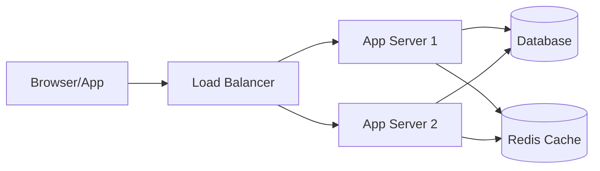

# Deployment Guide

**Service Name:** [Service Name]
**Last Updated:** YYYY-MM-DD

## 1. Prerequisites
- **Runtime**: [e.g., Node.js 20+, Java 21+, Python 3.12+]
- **Database**: [e.g., PostgreSQL 16+, MySQL 8+]
- **Tools**: [e.g., Docker 24+, Docker Compose v2]
- **Credentials**: Access to [secret manager / deployment platform]

## 2. Environment Setup

Refer to `docs/tech/env-config.md` for the full list of environment variables.

### Quick Start (Local Development)
```bash
# Clone the repository
git clone [repository-url]

# Copy environment template
cp .env.example .env

# Fill in required values in .env
# Then install and run:
[install command, e.g., npm ci]
[start command, e.g., npm run dev]
```

## 3. Deployment Steps

### A. Staging Deployment
```bash
# 1. Ensure all tests pass
[test command]

# 2. Build the application
[build command]

# 3. Deploy to staging
[deploy command]

# 4. Run smoke tests
[smoke test command]
```

### B. Production Deployment
```bash
# 1. Create release tag
git tag -a v[X.Y.Z] -m "Release v[X.Y.Z]"
git push origin v[X.Y.Z]

# 2. Build production image
[build command]

# 3. Run database migrations (if any)
[migration command]

# 4. Deploy with zero-downtime strategy
[deploy command]

# 5. Verify deployment
curl https://[production-url]/health
```

## 4. Database Migrations

```bash
# Run pending migrations
[migration run command]

# Check migration status
[migration status command]

# Rollback last migration (emergency)
[migration rollback command]
```

## 5. Rollback Procedure

1. **Identify** the last known good version/tag.
2. **Revert** deployment to previous version:
   ```bash
   [rollback command]
   ```
3. **Verify** service health after rollback.
4. **Communicate** rollback to stakeholders.

## 6. Post-Deployment Checklist

- [ ] Health endpoint returns 200.
- [ ] Core user flows work (login, main feature).
- [ ] Error rate below threshold (< 1%).
- [ ] No new errors in monitoring dashboard.
- [ ] Database migrations applied successfully.

## 7. Infrastructure Diagram


